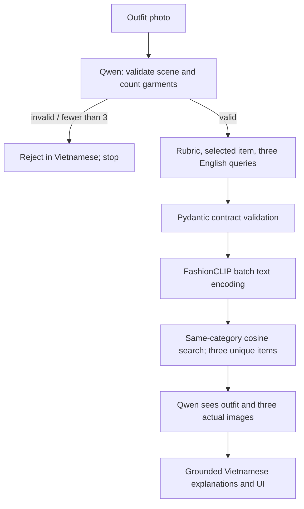

# Outfit Advisor · VLM

A production-oriented MVP for uploading one outfit photo, receiving a five-part 0–100 rubric assessment, and exploring exactly three **real catalog items** as replacements. Vietnamese interface and explanations; local Qwen3-VL-4B-Instruct and manifest-matched FashionCLIP retrieval.

This is a **model/rubric-dependent assessment**, not an objective fashion standard or a percentage of people who will like an outfit. Catalog images are dataset reference items, not live store inventory.

## Quick start on a GPU server

```bash
git clone --branch feat/end-to-end-vlm-recommender https://github.com/ThinhTran2208/outfit-vlm-recommender.git
cd outfit-vlm-recommender
cp .env.example .env
```

Provision the actual cache, manifest, Core-7 metadata and images using [artifacts/README.md](artifacts/README.md), then:

```bash
docker compose -f docker-compose.gpu.yml config --quiet
docker compose -f docker-compose.gpu.yml up -d --build
curl --fail http://localhost:57260/api/ready
```

Open `http://SERVER_IP:57260` after readiness succeeds. This repository has not been deployed to a supplied server; substitute your host IP. [Full deployment instructions](docs/DEPLOYMENT.md) include exact image provisioning commands, GPU setup, no-Docker development, smoke tests and troubleshooting.

## End-to-end flow



No RF-DETR, compatibility scorer, calibration or leave-one-out path is used. The first call handles validation, extraction and conditional scoring. The second call cannot occur until actual images have been retrieved. Models load once; GPU jobs are gated, default concurrency 1.

## Product contract

Only **Top, Bottom, Outerwear, Shoes, Bag, Dress, Hat** count. Dress counts once; a shoe pair counts once; visible Top and Outerwear count separately. Accessories such as belts, jewelry, eyewear, socks, scarves and phones are excluded. A scene with a second person, mannequin or confusing background clothing is rejected. Fewer than three canonical garments returns `NOT_ENOUGH_ITEMS`, with no score or retrieval.

| Rubric dimension | Maximum |
|---|---:|
| Color harmony | 20 |
| Style coherence | 20 |
| Silhouette/proportion | 20 |
| Formality/occasion coherence | 20 |
| Overall styling | 20 |

The validated sum is the displayed score. One real detected garment is selected. At score **85 or higher** (configurable), the UI offers similar alternatives without implying that the original outfit is wrong. Otherwise it describes potential improvements. Three concise English queries must name that same category. Category-filtered search returns three unique item IDs; subsequent rationale must use the five allowed facets and actual candidate images.

## Source and artifacts

The actual Drive cache and all three metadata splits were inspected. The cache has **142,480 × 512 FP16 L2 embeddings**, model `patrickjohncyh/fashion-clip`. **78,182 Core-7 metadata items** join successfully; the other embeddings are excluded. The loader verifies hash, schema, dimension, dtype, model, normalization and IDs before startup completes. Preparation joins original metadata to real image files or original ZIP entries, decoding every candidate once offline.

[Inspection evidence and category counts](docs/ARTIFACT_INSPECTION.md) · [Artifact layout and preparation](artifacts/README.md)

Never commit model weights, image archives, embeddings, HF cache or user uploads. Deployment works from ordinary server-mounted artifacts and HF cache, without ChatGPT or Drive connector dependencies.

## Repository layout

```
backend/app/       FastAPI, configuration, schemas and error boundary
  services/        Qwen, FashionCLIP, catalog/retrieval and orchestration
  prompts/         Versioned first/second-pass instructions
backend/tests/     CPU contract, retrieval, API and mock integration tests
frontend/src/      Vietnamese React/TypeScript interface and responsive CSS
scripts/           Image provisioning, catalog preparation and GPU smoke
artifacts/         README only; runtime files ignored by Git
Dockerfile         GPU backend, no baked weights, non-root runtime
frontend/Dockerfile  Production React build and non-root nginx
docker-compose.gpu.yml  NVIDIA GPU reservation and port 57260
```

## API

- `GET /api/health`: process health.
- `GET /api/ready`: 503 until catalog and both models are loaded.
- `POST /api/analyze`: multipart `image`, JPEG/PNG/WebP, max 10 MB by default.
- `GET /api/items/{item_id}/image`: actual catalog image; known IDs only.
- `/docs`, `/openapi.json`: backend OpenAPI documentation, accessible directly on the internal backend/dev port.

```bash
curl --fail http://localhost:57260/api/analyze -F 'image=@outfit.jpg'
```

A rejection:

```json
{"status":"rejected","error_code":"NOT_ENOUGH_ITEMS","message_vi":"Không đủ item để đánh giá.","counted_item_count":0,"garments":[]}
```

See [complete synthetic successful response](docs/example_response.json) and [VLM contract](docs/VLM_CONTRACT.md). Malformed JSON is safely parsed/reframed and retried once. Raw LLM output never reaches the browser.

## Interface

Charcoal/lime theme, large headline, upload preview beside analysis controls, five score bars, selected-item panel, three real-image recommendation cards, and final Vietnamese commentary. Upload/clear controls remain disabled during inference; the selected photo remains visible. Mobile CSS stacks the workflow and cards without fixed-width page content.

Two user-supplied screenshots were incorporated during implementation: a shared upload/analysis panel and a shared selected-item/three-card/commentary panel. Labels and scoring follow the new VLM-first requirements. Browser capture in the authoring environment was blocked, so this README does not include a fabricated screenshot; browser/mobile QA remains a handoff limitation. Production build was verified. See [validation record](docs/VALIDATION.md).

## Configuration

All values are documented in `.env.example` and validated in `Settings`.

| Variable | Default / purpose |
|---|---|
| QWEN_MODEL_ID | Fixed `Qwen/Qwen3-VL-4B-Instruct` |
| QWEN_REVISION | `main`; pin an HF commit for a reproducible deployment |
| QWEN_DTYPE | `auto`: BF16 if supported, otherwise FP16 |
| FASHIONCLIP_REVISION | `main`; model ID comes from manifest |
| HF_HOME | Local cache; Compose overrides to persistent `/cache/huggingface` |
| ARTIFACT_HOST_DIR | Host mount source, default `./artifacts` |
| ARTIFACT_DIR | Artifact root; Compose overrides to `/app/artifacts` |
| FASHIONCLIP_EMBEDDINGS_PATH | Cache `.pt` path |
| EMBEDDING_MANIFEST_PATH | Original manifest JSON |
| RETRIEVAL_CATALOG_PATH | Prepared verified catalog JSONL |
| MAX_CONCURRENT_VLM_REQUESTS | 1; applies to the complete pipeline |
| HIGH_SCORE_SIMILARITY_THRESHOLD | 85 |
| MAX_UPLOAD_MB / MAX_IMAGE_PIXELS | 10 MB / 20 million decoded pixels |
| VISION_MAX_PIXELS | 802,816 per Qwen image |
| MAX_NEW_TOKENS | 2,500 per generation |
| REQUEST_TIMEOUT_SECONDS | 180; timed-out GPU jobs retain admission slots until finished |
| QUEUE_TIMEOUT_SECONDS | 2; busy response rather than unbounded queue |
| APP_PORT | 8000 for documented dev command; Docker internal port is fixed |

If increasing upload/time limits, align nginx and frontend limits/timeouts. Do not set more Uvicorn workers. JSON logs contain request IDs, safe error types, and `image_validation_ms`, `vlm_analysis_ms`, `fashionclip_query_embedding_ms`, `retrieval_ms`, `vlm_explanation_ms`, `total_ms` for executed stages; no raw images or model output.

## Tests

```bash
python -m venv .venv
source .venv/bin/activate
python -m pip install torch==2.6.0 torchvision==0.21.0 --index-url https://download.pytorch.org/whl/cpu
python -m pip install -r backend/requirements.txt -r backend/requirements-dev.txt
python -m pytest -q
python -m ruff check backend scripts
python -m ruff format --check backend scripts
cd frontend
npm ci
npm run build
```

CI downloads neither Qwen weights nor the real embedding cache. Synthetic caches and fake VLM responses cover rejection short-circuits, score sums/ranges, selected IDs, three-query/category contracts, unique nearest-neighbor fallback, malformed JSON retry, grounded IDs/facets, API uploads/media/readiness, and timeout concurrency. A real tiny randomly initialized CLIP verifies projected text output handling without model downloads.

## Known limitations

- Real Qwen GPU inference, VRAM/latency and end-to-end perceptual quality must be verified on the deployment server. A passing mock test is not a real model result.
- Structural validation cannot prove scene interpretation, accurate garment counting, semantic query diversity or grounded natural-language claims. These require visual evaluation on representative photos.
- The original embedding manifest does not record the FashionCLIP commit hash. Model ID matches; exact historical checkpoint revision is not established.
- Catalog items come from a dataset; they do not imply current stock, price or purchase links.
- No authentication, persistent upload history, distributed inference queue or multi-GPU orchestration. Nginx includes modest admission rate limits; control exposure according to deployment needs.
- Screenshot/mobile browser QA could not be completed in the authoring environment.

[Architecture](docs/ARCHITECTURE.md) · [Deployment](docs/DEPLOYMENT.md) · [Validation](docs/VALIDATION.md)
