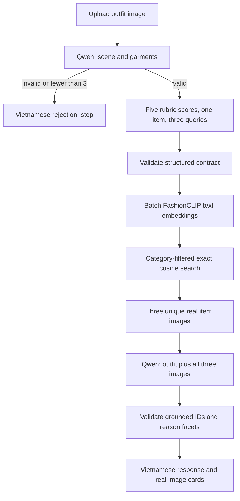

# VLM-first architecture

The first Qwen call combines scene inspection, garment extraction and conditional scoring. It must omit scoring fields on rejection. Pydantic independently enforces the structural rules before retrieval. It cannot prove that a garment is visually present: that is a VLM perception limitation, not a schema guarantee.

Five 0–20 integers sum exactly to the 0–100 score. The system always selects one existing garment; scores at/above configurable 85 use `similar_alternative`. No score is recomputed after replacement and no causal “largest effect” claim is inferred from this selection. No detector, compatibility scorer, calibration, LOO, vector database or generative product image is involved.

## Retrieval

The cache is preloaded once and verified against the actual manifest/hash. Original FP16 image vectors are converted to FP32 and renormalized to remove quantization drift. Category row indices are built once from the prepared catalog, which joins 78,182 observed Core-7 metadata IDs to real images.

Three FashionCLIP projected text embeddings are computed in one CPU batch and L2-normalized. Matrix multiplication uses only candidate rows in the selected category. Each query chooses the highest-ranked item not already selected; ties are stable in cache order. Duplicate top-1 matches naturally fall through to the next candidate. Insufficient catalog candidates fail with a controlled error. Text queries never become fabricated products.

Second-pass messages contain four image objects: original outfit, then the three selected images with rank and item-ID labels. The first analysis, matching queries, categories and IDs are included as context. The output must preserve the exact candidate order/IDs. Facets are enums. The final deterministic Vietnamese template preserves improve/similar-alternative semantics.

## Runtime and concurrency

One Uvicorn worker. Models/catalog load once in a background startup task. Health is live while readiness remains 503; failed initialization leaves readiness unavailable, with a safe error type in JSON logs. Fix artifacts/config and restart after a startup error.

A bounded inference executor and an admission semaphore share `MAX_CONCURRENT_VLM_REQUESTS`, default 1. A slot covers both Qwen passes and retrieval. Busy admissions fail after a short queue timeout. HTTP deadlines shield the running job and retain its slot until its thread actually finishes, even after the client times out. Qwen also uses a stopping criterion checked after each generated token. CUDA kernels cannot be forcibly preempted by this deadline; a hung driver requires operator recovery. Multiworker deployment would duplicate models and bypass the single-process gate, so is unsupported for this MVP.

Images are decoded with extension/MIME/format agreement, byte and pixel limits, EXIF orientation, and RGB conversion. Multipart temporary files are closed by the form context. In-memory PIL images are closed when work completes. No persistent upload path exists.

## HTTP boundary

Nginx serves the production React build and proxies relative `/api` to the internal backend. Only port 57260 is exposed. Nginx limits upload bytes/rate and returns JSON for body-limit/rate errors. Backend validates again. No permissive CORS middleware is installed. Dataset media endpoints resolve only known catalog IDs and re-encode verified RGB images; client input cannot select a path or URL. Runtime cache/artifacts are externally mounted; containers run without root.

## Limits

Scores and scene judgments remain model/rubric dependent. The English noun validator is intentionally conservative, not a complete natural-language classifier; rare valid nouns may be retried/rejected. Semantic near-duplicate query avoidance and visible-attribute grounding are prompted, but are not mathematically guaranteed. The manifest does not include the original encoder commit hash. Full GPU latency/VRAM and perception quality require the supplied manual smoke/evaluation procedure.
